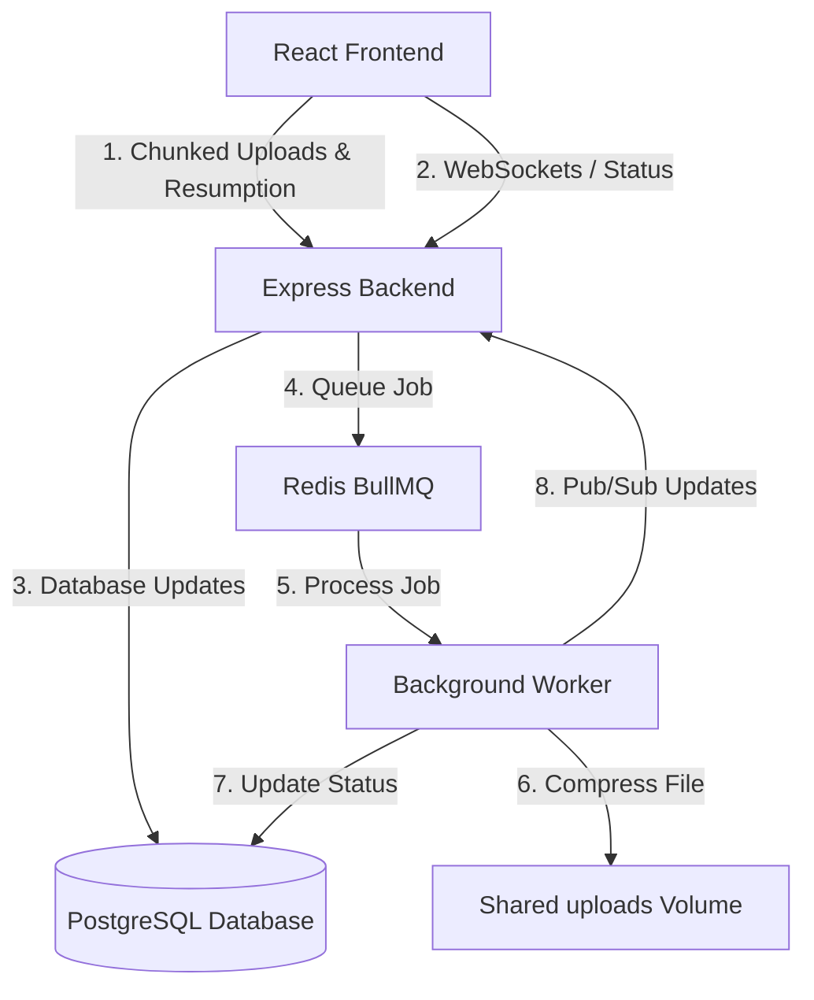

# Distributed File Processing Pipeline

A robust, production-grade distributed file processing pipeline featuring chunked file uploads, upload resumption, real-time progress updates, and background file compression/processing using worker queues.

## 🚀 Key Features

- **Chunked File Uploads:** Supports uploading large files by splitting them into smaller chunks.
- **Integrity Validation:** Verifies MD5 checksum hashes for each chunk to prevent corruption.
- **Upload Resumption:** Automatically tracks uploaded chunks, allowing seamless recovery from network drops.
- **Distributed Processing Queue:** Utilizes **BullMQ** & **Redis** to offload heavy file compression tasks to background workers.
- **Real-Time Dashboards:** Displays job progress, throughput metrics, and worker node status via **Socket.IO** events.
- **Dockerized Architecture:** Scalable setup with Postgres database, Redis, Node.js backend, background workers, and Vite/React frontend.

---

## 🏗️ System Architecture

The pipeline consists of four major components:



1. **Frontend (Vite + React + TailwindCSS):**
   - High-performance UI designed for tracking active and historical file uploads.
   - Socket.IO client listens to real-time process statistics and compression states.
   - Calculates chunk MD5 checksums for integrity.

2. **Backend (Node.js + Express + Prisma):**
   - Exposes REST APIs for initiating upload sessions, uploading individual chunks, and triggering parallel/stream merging.
   - Communicates with PostgreSQL database using **Prisma ORM**.
   - Publishes processing tasks to BullMQ (Redis-backed).

3. **Background Worker (Node.js + BullMQ + Prisma):**
   - A dedicated processor that consumes file compression/processing jobs from the Redis queue.
   - Performs heavy CPU-bound tasks like file compression.
   - Saves processed files to the shared volume and updates PostgreSQL.
   - Publishes updates via Redis Pub/Sub back to the backend.

4. **Redis & PostgreSQL Services:**
   - PostgreSQL: Stores database tables for upload sessions, jobs, metrics, and file metadata.
   - Redis: Powers BullMQ queues and handles Socket.IO messaging pub/sub across worker processes.

---

## 🛠️ Tech Stack

- **Frontend:** React, TypeScript, Vite, TailwindCSS, Socket.IO Client, Lucide Icons, Axios.
- **Backend & Worker:** Node.js, Express, TypeScript, Prisma ORM, BullMQ, Redis, Winston Logger, Multer.
- **Infrastructure:** Docker, Docker Compose, PostgreSQL, Redis.

---

## 🚦 Getting Started

### Prerequisites
Make sure you have [Docker](https://docs.docker.com/get-docker/) and [Docker Compose](https://docs.docker.com/compose/install/) installed.

### Setup and Running

1. **Clone the Repository:**
   ```bash
   git clone https://github.com/Priyanshu-704/Distributed-file-system-----wisflux-assignment-.git
   cd Distributed-file-system-----wisflux-assignment-
   ```

2. **Configure Environment Variables:**
   Copy `.env.example` to `.env`:
   ```bash
   cp .env.example .env
   ```

3. **Spin Up Services:**
   Run the following command to build and launch all containers:
   ```bash
   docker-compose up --build
   ```

4. **Access the Applications:**
   - **Frontend UI:** [http://localhost:3001](http://localhost:3001)
   - **Backend API:** [http://localhost:5000](http://localhost:5000)

---

## 🐳 Docker Services Defined

- `postgres`: Database running on port `5433` (externally).
- `redis`: Redis cache & queue server running on port `6380` (externally).
- `backend`: REST API Server running on port `5000`.
- `worker`: Distributed Background processor.
- `frontend`: Vite React App running on port `3001`.
