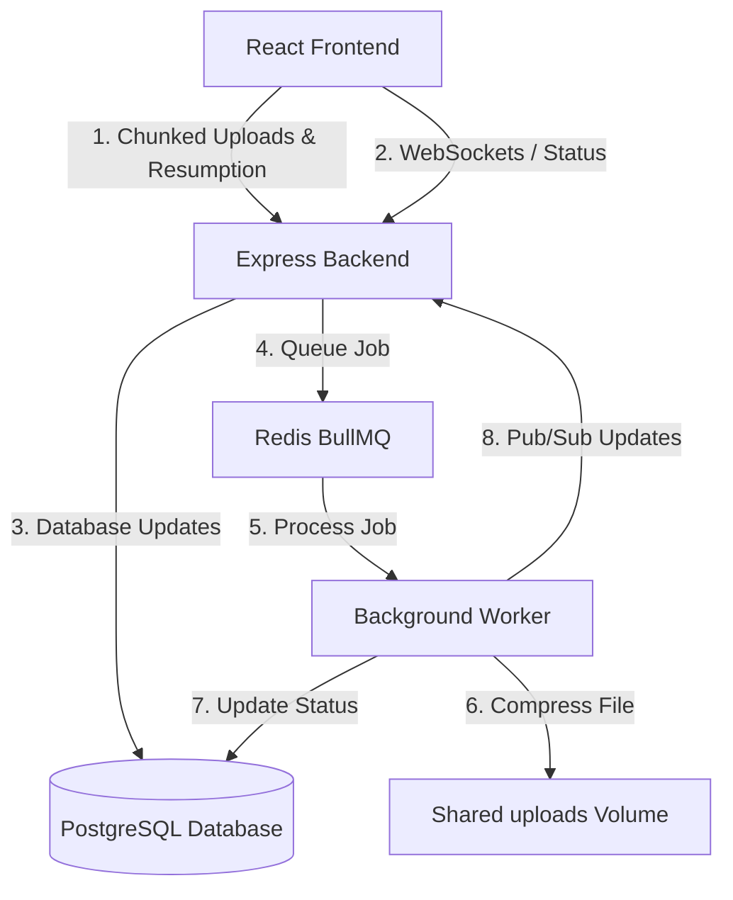

# Distributed File Processing Pipeline

A robust, production-grade distributed file processing pipeline featuring chunked file uploads, upload resumption, real-time progress updates, and background file compression/processing using worker queues.

## 🚀 Key Features

**File Upload System:**
- **Large file uploads:** Robust handling of heavy files without server memory exhaustion.
- **Chunk-based uploads:** Splits files into smaller, manageable pieces to optimize transfer speeds and stability.
- **Resume interrupted uploads:** Automatically tracks uploaded chunks, allowing seamless recovery from network drops.
- **Upload progress tracking:** Real-time visibility into the upload byte stream and completion percentages.
- **Multiple file support:** Initiate and process multiple file upload sessions concurrently.

**Processing Pipeline:**
- **Background worker services:** Dedicated Node.js worker nodes offload heavy processing tasks from the main API.
- **Queue-based file processing:** Utilizes **BullMQ** & **Redis** for robust, distributed job queuing.
- **Retry failed jobs:** Automatic retry logic and attempt tracking for resilience against transient failures.
- **Processing status tracking:** Emits real-time processing statistics and completion states via Socket.IO events.
- **File metadata management:** Stores comprehensive file and job metadata directly via scalable PostgreSQL structures.

**Real-Time Features:**
- **Live upload progress:** Instantaneous feedback during file uploads.
- **Processing updates using WebSockets:** Socket.IO integration for bi-directional, event-driven communication.
- **Real-time notifications:** Users are instantly notified of job completions, retries, and errors.

**Backend Engineering:**
- **Modular backend architecture:** Clean separation of concerns (routes, controllers, models, workers, middleware).
- **Queue management:** Highly scalable asynchronous job handling and throttling.
- **Logging system:** Structured, contextual logging utilizing Winston.
- **Global error handling:** Centralized catch-all error handling middleware preventing server crashes.
- **Validation middleware:** Robust schema validation for strict API payload verification.

**Redis Usage:**
- **Job queues:** Powers BullMQ to queue massive compression and processing payloads reliably.
- **Pub/Sub communication:** Connects isolated worker containers back to the backend node over independent channels.
- **Upload progress cache:** Extremely fast caching layers for high-throughput progress polling.
- **Retry queue handling:** Defers and schedules failed tasks directly inside Redis.

**Docker Architecture:**
- **Backend container:** Exposes the optimized Express.js REST and WebSocket APIs.
- **Frontend container:** Serves the lightning-fast Vite React client.
- **Redis container:** Dedicated memory cache for Pub/Sub and Queue tracking.
- **Database container:** Persists metadata utilizing isolated PostgreSQL storage.
- **Worker containers:** Decoupled computing nodes handling file IO and transformations.
- **Docker Compose setup:** A simple one-command orchestration unifying all multi-container services.

**Git/GitHub Workflow:**
- **Feature branch workflow:** Modular, isolated development mapping features to dedicated branches.
- **Pull requests:** Managed PR sequences allowing team-based code reviews and gating.
- **Meaningful commit messages:** Clear, descriptive commit history.
- **Documentation and setup guide:** Out-of-the-box readiness via comprehensive `README` details.

---

## 🏗️ System Architecture

The pipeline consists of four major components:



1. **Frontend (Vite + React + TailwindCSS):**
   - High-performance UI designed for tracking active and historical file uploads.
   - Socket.IO client listens to real-time process statistics and compression states.
   - Calculates chunk MD5 checksums for integrity.

2. **Backend (Node.js + Express + node-postgres):**
   - Exposes REST APIs for initiating upload sessions, uploading individual chunks, and triggering parallel/stream merging.
   - Communicates with PostgreSQL database using **highly optimized raw SQL queries**.
   - Publishes processing tasks to BullMQ (Redis-backed).

3. **Background Worker (Node.js + BullMQ + node-postgres):**
   - A dedicated processor that consumes file compression/processing jobs from the Redis queue.
   - Performs heavy CPU-bound tasks like file compression.
   - Saves processed files to the shared volume and updates PostgreSQL natively.
   - Publishes updates via Redis Pub/Sub back to the backend.

4. **Redis & PostgreSQL Services:**
   - PostgreSQL: Stores database tables for upload sessions, jobs, metrics, and file metadata.
   - Redis: Powers BullMQ queues and handles Socket.IO messaging pub/sub across worker processes.

---

## 🛠️ Tech Stack

- **Frontend:** React, TypeScript, Vite, TailwindCSS, Socket.IO Client, Lucide Icons, Axios.
- **Backend & Worker:** Node.js, Express, TypeScript, pg (node-postgres), BullMQ, Redis, Winston Logger, Multer.
- **Infrastructure:** Docker, Docker Compose, PostgreSQL, Redis.

---

## 🚦 Getting Started

### Prerequisites
Make sure you have [Docker](https://docs.docker.com/get-docker/) and [Docker Compose](https://docs.docker.com/compose/install/) installed.

### Setup and Running

1. **Clone the Repository:**
   ```bash
   git clone https://github.com/Priyanshu-704/Distributed-file-system-----wisflux-assignment-.git
   cd Distributed-file-system-----wisflux-assignment-
   ```

2. **Configure Environment Variables:**
   Copy `.env.example` to `.env`:
   ```bash
   cp .env.example .env
   ```

3. **Spin Up Services:**
   Run the following command to build and launch all containers:
   ```bash
   docker-compose up --build
   ```

4. **Access the Applications:**
   - **Frontend UI:** [http://localhost:3001](http://localhost:3001)
   - **Backend API:** [http://localhost:5000](http://localhost:5000)

---

## 🐳 Docker Services Defined

- `postgres`: Database running on port `5433` (externally).
- `redis`: Redis cache & queue server running on port `6380` (externally).
- `backend`: REST API Server running on port `5000`.
- `worker`: Distributed Background processor.
- `frontend`: Vite React App running on port `3001`.
